<p align="center">
  <picture>
    <source media="(prefers-color-scheme: dark)" srcset=".github/assets/banner-dark.svg">
    
  </picture>
</p>

<h3 align="center">AIR SDK versions, managed from your terminal.</h3>

<p align="center">
  <a href="https://github.com/emptyenemy/asm/releases/latest"></a>
  <a href="https://github.com/emptyenemy/asm/actions/workflows/build.yml"></a>
  
  <a href="go.mod"></a>
  <a href="LICENSE"></a>
</p>

<p align="center">
  <a href="https://emptyenemy.github.io/asm/"><b>Website</b></a> ·
  <a href="#install"><b>Install</b></a> ·
  <a href="#quick-start"><b>Quick start</b></a> ·
  <a href="#commands"><b>Commands</b></a> ·
  <a href="https://github.com/emptyenemy/asm/releases"><b>Releases</b></a>
</p>

<p align="center">
  
</p>

asm finds, installs, updates and removes [AIR SDK](https://airsdk.dev) builds.
It is one native binary for Windows, macOS and Linux, and it works with the
settings AIR SDK Manager already keeps: no runtime, no GUI, no admin rights.

## Why asm

- **Short versions.** `asm install 51.4` picks the newest stable 51.4 build.
  An exact build such as `51.4.1.1`, or `latest`, works too.
- **Your existing setup.** asm reads `~/.airsdk/airsdkmanager.cfg`, the file
  AIR SDK Manager writes. Your SDK folder stays where it is, and the manager's
  files are never rewritten.
- **Downloads that survive.** A dropped connection resumes from the bytes
  already on disk, on the next attempt or on the next run.
- **Verified before unpacking.** Every archive is checked against its published
  size and SHA-256 before a single file is extracted.
- **Three sources.** When the official API does not answer, asm falls back to
  the announcement archive and the shockpkg mirror, and says which one it used.
- **Safe updates.** The old SDK stays until the new one is in place. The path,
  `adt.cfg` and `adt.lic` carry over, so your tools keep working.
- **Recoverable.** Closed the terminal mid-install? `asm clean` removes the
  leftovers and puts a half-replaced SDK back.

## Install

**Windows**, in PowerShell:

```powershell
irm https://raw.githubusercontent.com/emptyenemy/asm/main/install.ps1 | iex
```

**macOS and Linux**:

```sh
curl -fsSL https://raw.githubusercontent.com/emptyenemy/asm/main/install.sh | sh
```

The installers pick the native binary for your machine, check it against the
release's `SHA256SUMS`, and stop rather than overwrite an unrelated command
called `asm`.

- **Windows:** `asm.exe` goes to `%LOCALAPPDATA%\Programs\asm`, on your user
  `PATH`. It works in the same PowerShell session; other open terminals need a
  restart.
- **macOS and Linux:** `asm` goes to `~/.local/bin`, which is added to
  `.zshrc`, `.bashrc`, `.bash_profile` or `.profile` for your shell. Open a new
  terminal, or source the profile the installer names.

<details>
<summary><b>Installer options</b></summary>

<br>

| Windows, `install.ps1` | macOS and Linux, `install.sh` | Effect |
| --- | --- | --- |
| `-Version 1.0.0` | `ASM_VERSION=1.0.0` | Install that asm release instead of the latest. |
| `-InstallDirectory C:\Tools\asm` | `ASM_INSTALL_DIR=/absolute/path` | Install somewhere else. |
| `-NoPath` | `ASM_NO_PATH=1` | Leave `PATH` and shell profiles unchanged. |
| `-ArchiveDirectory DIR` | `ASM_ARCHIVE_DIR=DIR` | Install from local release archives. Needs an explicit version and a directory with the matching archive and `SHA256SUMS`. |

PowerShell parameters need the script downloaded first:

```powershell
./install.ps1 -Version 1.0.0 -InstallDirectory C:\Tools\asm
```

Shell variables go in front of `sh`:

```sh
curl -fsSL https://raw.githubusercontent.com/emptyenemy/asm/main/install.sh | ASM_NO_PATH=1 sh
```

Existing `PATH` entries are kept, and a repeated install replaces only an
installation owned by asm. Archives, staging files and previous asm binaries
are removed after a successful install. The installer sets up the `asm` command
only; where SDKs go still comes from the AIR SDK Manager settings.

</details>

<details>
<summary><b>Build from source</b></summary>

<br>

With Go 1.27.1 or newer:

```sh
go build .
./asm --version
```

In PowerShell, run `./asm.exe`. Add the folder to `PATH` to run `asm` from
anywhere. A released binary is smaller, because the release workflow strips
the symbol table and debug information and disables cgo;
[AGENTS.md](AGENTS.md#release-build-flags) has the exact command.

</details>

## Quick start

asm uses the AIR SDK Manager settings. If you have run the manager, there is
nothing to set up. Otherwise create `~/.airsdk/airsdkmanager.cfg`
(`%USERPROFILE%\.airsdk\airsdkmanager.cfg` on Windows):

```ini
AIR_SDKS=C:\AIRSDK
HAS_ACCEPTED_LICENSE=true
```

`AIR_SDKS` is the folder for your SDKs, wherever you like. The second line
records that you accept the AIR SDK license; leave it out and pass
`--accept-license` to a single `install` or `update` instead. The flag changes
nothing on disk.

Then:

```sh
asm search 51.4      # stable releases in the 51.4 branch
asm install 51.4     # the newest of them
asm list             # what is installed, and where
asm update           # newer builds for what you have
```

## Commands

| Command | What it does |
| --- | --- |
| `asm list`, `asm ls` | List installed SDKs and their paths, newest first. |
| `asm search [VERSION]` | List stable releases, newest first. A version narrows the list. |
| `asm install [VERSION]` | Install a branch such as `51.4`, an exact build, or `latest`. |
| `asm update` | Show newer builds of installed SDKs, and a newer branch if there is one. |
| `asm update [VERSION]` | Update the installed SDKs that match. |
| `asm update --all` | Update every installed SDK that has a newer build. |
| `asm update [VERSION] --check` | Preview the updates for matching SDKs. |
| `asm update --all --check` | Preview every update and the new-branch notice. |
| `asm uninstall [VERSION]`, `asm remove [VERSION]` | Remove one installed SDK, chosen by exact build or an unambiguous prefix. |
| `asm clean` | Remove what an interrupted install or update left behind. |
| `asm clean --check` | List what `clean` would change, without changing it. |
| `asm help [COMMAND]` | Show help for asm or one command. |
| `asm --version`, `asm -v` | Print the asm version, such as `1.0.0`. |

Square brackets mark a value you supply: type `51.4`, not `[51.4]`. `install`
and `uninstall` need a version; `search`, `update` and `help` take one
optionally. `asm --help`, `asm -h` and `asm install --help` work too.

Errors and warnings go to stderr. A successful command exits with `0`, an error
with `1`. Unknown commands and unexpected arguments are rejected.

## How each command behaves

<details>
<summary><b>list</b>: what is installed</summary>

<br>

```sh
asm list
```

Only the immediate subfolders of `AIR_SDKS` are examined, as in AIR SDK
Manager. Folder names do not matter: the version comes from
`air-sdk-description.xml`, where `<version>51.3.4</version>` and
`<build>3</build>` make `51.3.4.3`. A four-component `<version>` is read as is.

Versions are sorted numerically, newest first. Folders without a description
are skipped, and an unreadable description produces a warning. Missing
settings, an empty `AIR_SDKS` or a missing SDK folder are errors. An existing
empty folder prints a message and exits with `0`.

</details>

<details>
<summary><b>search</b>: what is available</summary>

<br>

```sh
asm search
asm search 51.4
asm search 51.4.1.1
```

Filters match whole version components: `51.4` does not match `51.40`. A
four-component filter needs an exact match. Results are full build numbers,
newest first; no match prints a message and exits with `0`.

The release list comes from the official AIR SDK API, then from the
[announcement archive](https://airsdk.dev/news/archive), then from the catalog
AIR SDK Manager saved in `airsdkmanager.db` and its `airsdkmanager.db.backup*`
copies, newest first. A warning names the source used when the first one
fails; a saved catalog may be out of date. Failing to get any usable list is an
error.

The announcement archive has fresh releases but can miss older builds that had
no announcement of their own. Beta, alpha and preview entries are skipped by
title, and the previews `51.0.0.2` and `51.0.0.4`, titled as releases, are
skipped by number.

</details>

<details>
<summary><b>install</b>: add an SDK</summary>

<br>

```sh
asm install 51.4
asm install 51.4.1.1
asm install latest
asm install 51.4 --accept-license
```

`51`, `51.4` and `51.4.1` resolve to the newest matching stable build, and
`latest` to the newest stable build overall; all four components are compared
numerically. An exact version goes straight to the download source, so builds
without an announcement can be installed too. A version that does not exist is
an error; asm never substitutes a different build.

`51.4.1.1` installs into `AIR_SDKS\AIRSDK_51.4.1.1`, creating `AIR_SDKS` if
needed. A build that is already installed is recognised by its description,
whatever its folder is called, and is not downloaded again. A destination that
already holds other files is refused. Installing does not change the SDK your
projects use or `PATH`.

The SDK is assembled in a hidden staging folder inside `AIR_SDKS` and moved
into place in one step. Downloads come from the official API first and from
the shockpkg mirror if that fails at any point. An interrupted download is kept
in `AIR_SDKS/.asm-partial`, named after its expected SHA-256, and continues
from the stored bytes: up to four attempts with 1, 2 and 4 second pauses, and a
transfer that receives nothing for 30 seconds is restarted. Partial files that
fail verification, and ones older than seven days, are deleted.

Each archive is checked for size and SHA-256 before it is extracted, and every
extracted path must stay inside the SDK folder. On macOS and Linux, executable
permissions and safe relative symbolic links are kept. Linux SDKs run
`configure_linux.sh` when it is present, and ARM64 requires it. On macOS the
quarantine flag is removed if present, without asking for an administrator
password.

</details>

<details>
<summary><b>update</b>: newer builds of what you have</summary>

<br>

```sh
asm update
asm update 51.3 --check
asm update 51.3
asm update 51.3.4.1
asm update --all
asm update --all --accept-license
```

Without arguments, asm lists installed SDKs that have a newer build, with
paths, and changes nothing. It also announces the newest stable release when it
is newer than every installed SDK and its branch is not installed:

```text
Installed SDKs are up to date.

New AIR SDK available: 51.4.1.1
Install: asm install 51.4
```

The notice also appears with `--check`, `--all` and `--all --check`, and
disappears once that branch is installed. An empty SDK folder gets a
suggestion to install the newest stable version. A version argument narrows
the overview to the installed SDKs it matches.

`--all` applies every available update. A version selects installed SDKs by
prefix; a full number selects the installation, not the target build.
`--check` can go before or after the version. A version and `--all` cannot be
combined.

As in AIR SDK Manager, an update changes only the fourth component: `51.3.4.1`
becomes `51.3.4.3`, while `51.3.3` and `51.3.4` stay separate SDKs. New
branches are installed with `install`. The SDK keeps its path, `lib/adt.cfg`
and `lib/adt.lic`, so existing tool paths stay valid. The old SDK is renamed
aside until the new one is in place and is restored if the swap fails.

No matching installation is an error that suggests `asm list`; no available
update is a success. `--all` updates SDKs one after another and stops at the
first error, keeping the updates already finished.

</details>

<details>
<summary><b>uninstall</b>: remove an SDK</summary>

<br>

```sh
asm uninstall 51.4
asm uninstall 51.3.4.3
asm remove 51.4.1.1
```

An exact build or a prefix must match exactly one installed SDK. An ambiguous
prefix lists the matching versions and paths and deletes nothing; no match is
an error too. `latest`, `--all` and several versions in one command are not
supported.

The SDK folder is deleted directly, without a backup. asm first checks its
description and that it lies inside `AIR_SDKS`, refuses symbolic-link folders,
and takes the same lock as `install` and `update`. Manager settings, other SDKs
and `PATH` stay unchanged. If files are locked or removal fails, the error
names the folder that needs attention.

</details>

<details>
<summary><b>clean</b>: after an interrupted run</summary>

<br>

`Ctrl+C` stops an operation and cleans up what it staged. Closing the terminal,
pressing `Ctrl+C` twice, killing the process or losing power skips that
cleanup, and `asm clean` is the way back:

| Leftover | What `clean` does |
| --- | --- |
| `.asm-partial` | Removes incomplete downloads. The next install starts over instead of resuming. |
| `.asm-install-*`, `.asm-update-*` | Removes staging folders from an interrupted install or update. |
| `.asm-old-*` | An SDK renamed aside during an update: moved back when its build is no longer installed, removed when it is. |
| An empty version folder | Removed, since it would block installing that version again. |

`clean` takes the same lock as `install` and `update`, so it refuses to run
beside them. Installed SDKs, settings and unrelated files are never touched. A
saved SDK whose description cannot be read is reported and left in place.
`clean --check` prints the same report and changes nothing.

</details>

<details>
<summary><b>Terminal output</b></summary>

<br>

In an interactive terminal every answer sits between two blank lines, indented
by two columns. The indigo accent (`#818CF8`) marks headings, versions, results
and the command to run next; labels and side notes are muted, and warnings and
errors are marked in amber and red. Versions and paths line up in columns, and
narrow terminals get stacked entries and wrapped paths. Requests show a spinner;
downloads show a bar with the bytes transferred, the percentage when the size
is known, and the average speed. Progress goes to stderr and is cleared when it
finishes.

`NO_COLOR` turns colors off and keeps the animation. `TERM=dumb` or redirecting
either output stream turns off both, and search results become one full
version per line, without headings or suggestions. `--version` prints only the
version, which makes it easy to use in scripts. The installers follow the same
rules.

</details>

## Limitations

- **Windows on ARM is not supported.** There is no native Windows ARM64 AIR
  SDK, so the installer stops with that message.
- **The live download service is not verified on every host yet.** Commands,
  settings handling and SDK assembly are covered by tests on all five builds,
  but downloading a real SDK has not been checked everywhere. If something
  breaks, [open an issue](https://github.com/emptyenemy/asm/issues) with the
  command and its output.
- **The AIR SDK license is yours to accept.** asm downloads nothing until it
  has been accepted, in the manager settings or with `--accept-license` for a
  single operation.

## Contributing

Bug reports and pull requests are welcome. [AGENTS.md](AGENTS.md) covers the
code layout, building and testing, the commit conventions, and the notes on
the AIR SDK sources asm talks to.

## License

MIT, see [LICENSE](LICENSE). asm is an independent project. The AIR SDK itself
is a separate product licensed by HARMAN.
