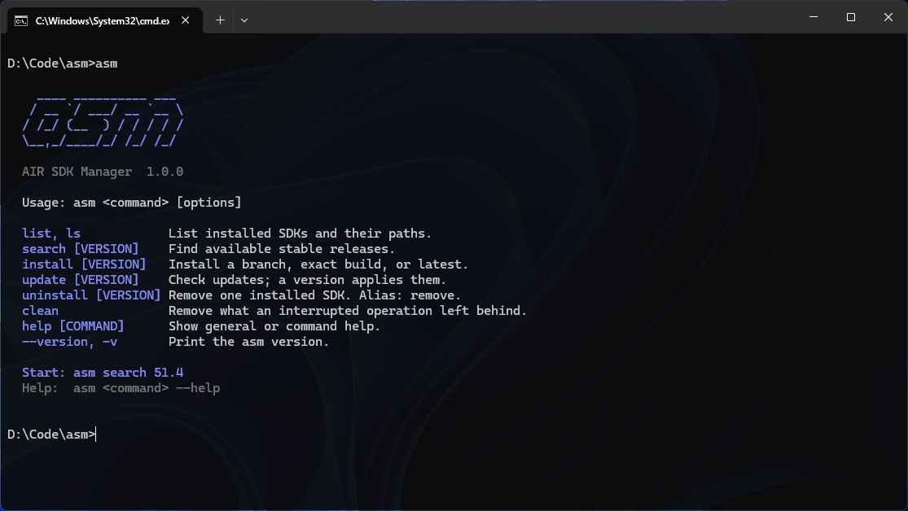

# asm

A command-line version manager for AIR SDK. List installed SDKs, find available
releases, install a version, and update existing installations.



Version **1.0.0 is in development**. There are no published releases yet.
The implementation uses **Go** and its standard library. One native executable
runs on Windows, macOS, or Linux without PowerShell or a Go installation.

## Getting started

### Install a published release

These commands will work once the first release has been published. The
installers select the native binary and verify it against the release's
`SHA256SUMS` before installation.

Windows PowerShell:

```powershell
irm https://raw.githubusercontent.com/emptyenemy/asm/main/install.ps1 | iex
```

macOS or Linux:

```sh
curl -fsSL https://raw.githubusercontent.com/emptyenemy/asm/main/install.sh | sh
```

The Windows installer puts `asm.exe` in `%LOCALAPPDATA%\Programs\asm`, updates
the user `PATH`, and makes `asm` available in the current PowerShell session.
Other open terminals need to be reopened. The Unix installer uses
`~/.local/bin` and adds it to `.zshrc`, `.bashrc`, `.bash_profile`, or `.profile`
for the detected shell. Open a new terminal or source the profile printed by
the installer. Existing `PATH` entries are kept; repeated installs replace
only an installation owned by asm. An unrelated command named `asm` stops
installation with a message identifying the conflict.

To select an asm version or installation directory, download
[install.ps1](https://raw.githubusercontent.com/emptyenemy/asm/main/install.ps1)
and run `./install.ps1 -Version 1.0.0 -InstallDirectory C:\Tools\asm`, or use
`ASM_VERSION=1.0.0` and `ASM_INSTALL_DIR=/absolute/path` when running
[install.sh](https://raw.githubusercontent.com/emptyenemy/asm/main/install.sh).
`-NoPath` / `ASM_NO_PATH=1` leaves shell configuration unchanged.
For local release archives, use `-ArchiveDirectory` / `ASM_ARCHIVE_DIR` with an
explicit version and a directory containing the matching archive and
`SHA256SUMS`. Archives, staging files, and previous asm binaries are removed
after successful installation. The installer configures the asm command;
AIR SDK paths still come from AIR SDK Manager settings.

### Build from source

With Go 1.27.1 or newer:

```sh
go build .
```

From the project directory after building:

```bat
asm --version
asm list
asm search 51.4
asm install 51.4
asm update
```

In PowerShell, use `./asm.exe`; on macOS/Linux, use `./asm`. Add the executable's
directory to `PATH` to run `asm` from other directories. `asm --version` and
`asm -v` print only `1.0.0`, with an indigo accent in an interactive terminal.

A released binary is smaller than that one, because the release workflow strips
the symbol table and debug information and disables cgo.
[AGENTS.md](AGENTS.md#release-build-flags) has the exact command and explains
what each flag does.

## SDK locations and configuration

asm reads the existing AIR SDK Manager configuration. It does not rewrite the
manager's settings or database. The SDK directory can be anywhere:

```ini
AIR_SDKS=C:\AIRSDK
HAS_ACCEPTED_LICENSE=true
```

asm reads `~/.airsdk/airsdkmanager.cfg`, using the current user's home directory
on each OS (`%USERPROFILE%` on Windows). No directory argument is needed for
each command.

Downloading requires acceptance of the AIR SDK license: either
`HAS_ACCEPTED_LICENSE=true` in the manager configuration, or `--accept-license`
on `install`/`update`. The flag applies to the current operation and does not
change the configuration. [AGENTS.md](AGENTS.md#manager-configuration-on-macos-and-linux)
records the exact locations on each platform.

## Terminal output

General help includes a compact ASCII banner. Interactive output uses an
indigo accent (`#818CF8`), aligned version/path columns, and suggestions for the
next command. Narrow terminals use stacked entries and wrapped paths.
The bootstrap installers use the same banner, colors, and custom activity
indicators. Metadata requests show a spinner; binary downloads show bytes and
a progress bar when the server supplies a size. `NO_COLOR`, `TERM=dumb`, and
redirected output are respected by the installers too.

Catalog and manifest requests display a spinner. Downloads use a custom bar
with transferred bytes, percentage when the total is known, and average speed.
Unknown-size downloads show activity and bytes without inventing a percentage.
SHA-256 is calculated while streaming the download; extraction and platform
configuration also display activity. Progress is rendered directly by asm.

Progress goes to stderr and clears on completion or error. Redirecting either
output stream disables colors and animation; `TERM=dumb` does the same.
`NO_COLOR` disables colors while retaining activity in an interactive terminal.
Redirected search results remain one full version per line, without headings or
installation suggestions. `--version` and `-v` print only `1.0.0`, accented in
an interactive terminal and plain when redirected or with `NO_COLOR`.

## Commands

| Command | Behavior |
| --- | --- |
| `asm help [COMMAND]` | Show general or command help. Running `asm` without arguments also shows help. |
| `asm --version`, `asm -v` | Print only the manager version: `1.0.0`. |
| `asm list`, `asm ls` | List installed SDK versions and absolute paths. |
| `asm search [VERSION]` | List announced stable releases, newest first. |
| `asm install [VERSION]` | Install a branch, an exact build, or `latest`. |
| `asm uninstall [VERSION]`, `asm remove [VERSION]` | Delete one installed SDK selected by exact version or an unambiguous prefix. |
| `asm update` | Show updates for installed SDKs and announce a newer uninstalled branch. |
| `asm update [VERSION]` | Update matching installed SDKs. |
| `asm update --all` | Update every installed SDK that has a newer build. |
| `asm update [VERSION] --check` | Preview updates for selected SDKs. |
| `asm update --all --check` | Preview all installed updates and the new-branch notice. |
| `asm clean` | Remove incomplete downloads and temporary directories left by an interrupted operation. |
| `asm clean --check` | List what `clean` would change without changing anything. |

Square brackets mark a placeholder: replace `[VERSION]` with the appropriate
value and do not type the brackets. `install` and `uninstall` require a
version; `search`, `update`, and `help` accept one optionally.

Help is also available through `asm --help`, `asm -h`, and commands such as
`asm install --help` or `asm update -h`. `install` requires a version.

Errors and warnings go to stderr. Successful commands return `0`; errors return
`1`. Unknown commands and unexpected arguments are rejected.

### List

```bat
asm list
```

Only immediate subdirectories of `AIR_SDKS` are examined, as in AIR SDK Manager.
Folder names are arbitrary. Versions come from `air-sdk-description.xml`:
`<version>51.3.4</version>` and `<build>3</build>` produce `51.3.4.3`.
A four-component number in `<version>` is also supported.

Versions are sorted numerically, newest first. Directories without a description are skipped;
invalid descriptions produce a warning. Missing settings, an empty `AIR_SDKS`,
or a missing SDK root are errors. An existing empty root produces an explanatory
message and returns `0`.

### Search

```bat
asm search
asm search 51.4
asm search 51.4.1.1
```

Filters match version components: `51.4` does not match `51.40`. An exact
four-component filter requires an exact match. Results are full build numbers,
newest first. No matches produce an explanatory message and return `0`.

The announcement archive includes fresh releases but may omit older builds
without individual announcements. Beta, alpha, and preview entries are excluded
by title. Known previews `51.0.0.2` and `51.0.0.4`, titled as releases, are
excluded explicitly.

When the source fails, asm reads `airsdkmanager.db`, then
`airsdkmanager.db.backup*` from newest to oldest. A warning identifies the
database used; its contents may be stale. Failure to obtain any usable catalog
is an error. This existing GUI database is separate from SDK archives.

### Install

```bat
asm install 51.4
asm install 51.4.1.1
asm install latest
asm install 51.4 --accept-license
```

`51`, `51.4`, and `51.4.1` resolve to the newest matching stable build;
`latest` resolves to the newest stable version. All four components are compared
numerically. An exact version queries the download source directly, allowing
installation of builds without an announcement. An unavailable version causes
an error instead of selecting a different build.

Version `51.4.1.1` installs into `AIR_SDKS\AIRSDK_51.4.1.1`. A missing root is
created. An existing matching version is detected by its description, regardless
of the directory name, and is reported without reinstalling it. An occupied
destination containing other files is rejected. Installation does not change
the selected SDK or `PATH`.

A download that is interrupted by a dropped connection resumes where it
stopped, and the next `asm install` continues a download the machine did not
finish. Every archive is verified against its published SHA-256 before it is
unpacked.

### Update

```bat
asm update
asm update 51.3 --check
asm update 51.3
asm update 51.3.4.1
asm update --all
asm update --all --accept-license
```

Without arguments, asm shows installed versions, available updates, and paths.
It also announces the newest stable release if it is newer than every installed
SDK and its three-component version is not installed:

```text
Installed SDKs are up to date.

New AIR SDK available: 51.4.1.1
Install: asm install 51.4
```

The notice also appears with `--check`, `--all`, and `--all --check`. It disappears
once that branch is installed. An empty SDK root receives a suggestion to
install the newest stable version. A positional filter restricts the overview
to matching installed SDKs.

`--all` applies updates to existing installations. A version selects installed
SDKs by prefix; a full number selects the current installation, not the target
build. `--check` can appear before or after the number. A number and `--all`
cannot be combined.

As in AIR SDK Manager, an update changes only the fourth component:
`51.3.4.1` to `51.3.4.3`. Installed `51.3.3` and `51.3.4` remain separate SDKs.
New branches are installed with `install`. The SDK path, `lib/adt.cfg`, and
`lib/adt.lic` are preserved, keeping existing tool paths valid.

No matching installation is an error with an `asm list` suggestion. No available
update is a successful result. `--all` processes SDKs sequentially and stops at
the first error; completed updates remain installed.

### Uninstall

```sh
asm uninstall 51.4
asm uninstall 51.3.4.3
asm remove 51.4.1.1
```

An exact build or a prefix must match exactly one installed SDK. Ambiguous
prefixes show the matching versions and paths and return an error; no SDK is
deleted. No match is also an error. `latest`, `--all`, and removing several
versions in one command are not supported.

The command deletes the selected SDK directory directly, without keeping a
backup. It validates the SDK description and its location below `AIR_SDKS`,
rejects symbolic-link directories, and shares the install/update lock. Manager
settings, other SDKs, and `PATH` remain unchanged. If files are locked or removal
otherwise fails, the error identifies the directory that needs attention.

### Clean

Cancelling with `Ctrl+C` stops the operation and cleans up what it staged.
Closing the terminal window, pressing `Ctrl+C` twice, killing the process, or
losing power skips that cleanup, and `asm clean` is the way back:

| Leftover | What `clean` does |
| --- | --- |
| `.asm-partial` | Removes incomplete downloads. The next install starts over instead of resuming. |
| `.asm-install-*`, `.asm-update-*` | Removes staging directories from an interrupted install or update. |
| `.asm-old-*` | An SDK renamed away for an update rollback: moved back when that build is no longer installed, removed when it is. |
| An empty version directory | Removed. A directory created just before its contents were moved in would otherwise block installing that version again. |

`clean` takes the same SDK root lock as `install` and `update`, so it refuses
to run beside them and releases the lock file on exit. Installed SDKs,
settings, and unrelated files are never touched. A saved SDK whose description
cannot be read is reported and left in place. `clean --check` prints the same
report without changing anything.

## Hacking on asm

[AGENTS.md](AGENTS.md) covers the code layout, the steps for adding a command,
the commit conventions, the test approach, and the notes on the AIR SDK sources
asm talks to.
